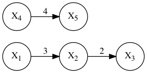
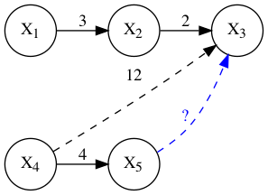
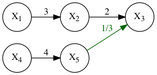

# README

This exercise is much easier to solve using DFS than Union Find, but I found it to be interesting to see how the Union Find would work.

Consider the following equations / values:

```go
x1 / x2 = 3
x2 / x3 = 2
x4 / x5 = 4
x4 / x2 = 6
```

This can be thought of as a graph, where the weight of an edge (the "distance" `d`) from `xi` to `xj` is the result of `xi / xj`, which gives us:


The idea of Union Find is to create a graph where all elements belonging to the same subset point to the same root node. Calculating the result of two variables `xi / xj` that belong to the same subset would then become: `Distance(xi, Find(xi))/Distance(xj, Find(xj))`

### Union'ing the input

The first three relationships is represented by the graph below:



At this stage the graph could have been created with or without Union Find. Both graphs point to a shared root.

However, when adding `x4->x2`, the two subsets should be combined into a single set, i.e. a "Union" operation.

To achieve this, `Find(x4)` should result in the same node as `Find(x2)`, or rather, the two subsets should point to the same root node. The goal is to determine the blue arrow below:


The first order of business is to calculate the distance between `x4` and `Find(x2)`, which is done by multiplying the distance between x4 and x2 with all edges until reaching x4:



Since x4 points directly to its root, the distance between `x4` and `Find(x4)` is simply 4.

To get the distance between x5 and x3, divide `dist(x4, x2) * dist(x2, root(x2))` with `dist(x4, root(x4))`:



Now, the solution to any query where both variables are in the same subset becomes: `Find(a)/Find(b)`